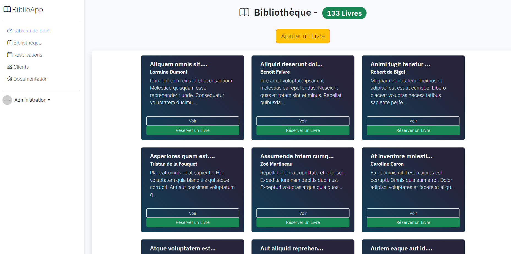
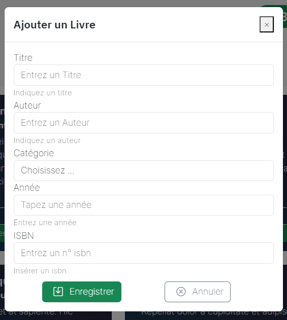
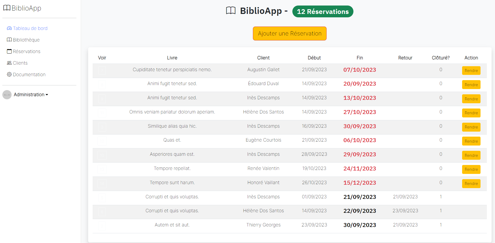
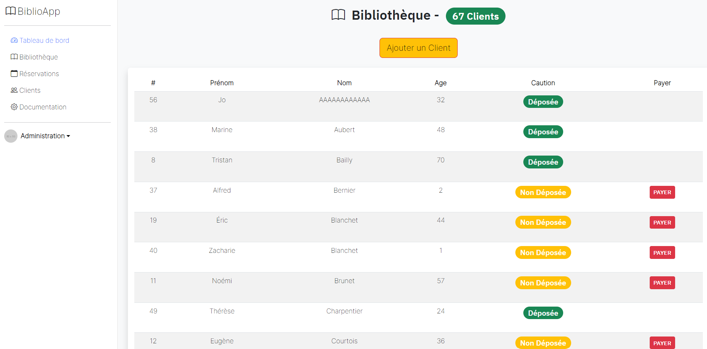
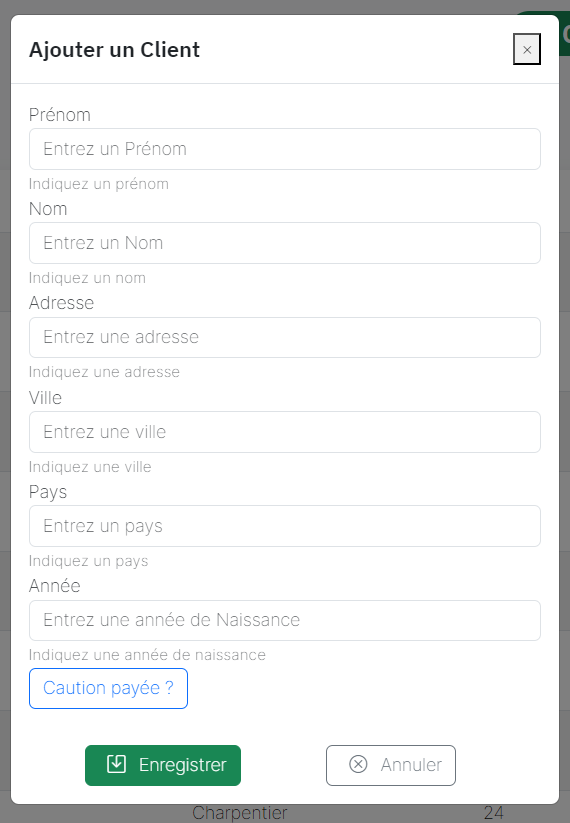

PHP - Gestion d'une bibliothèque : 
    - Liste de livres
      - Modifier, ajouter, supprimer un livre
    - Liste de Clients
      - Ajouter un client
    - Réservations
      - Ajouter une réservation,
      - Rendre un livre

  

